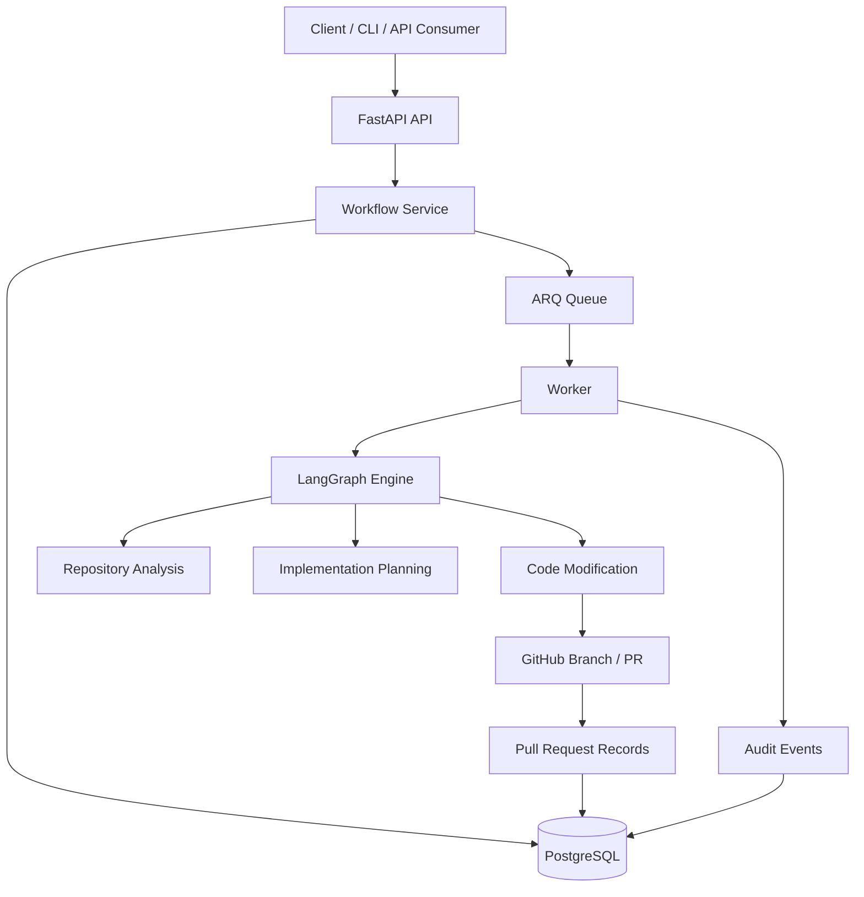

# Agentic Development Workflow Engine


Agentic Development Workflow Engine (ADWE) is a production-oriented platform engineering project that analyzes repositories, generates implementation plans, orchestrates agent workflows, records audit events, and lays the foundation for automated code modification and pull request creation.

## Architecture



The system consists of:

* FastAPI API layer
* PostgreSQL persistence
* Redis + ARQ background job queue
* LangGraph workflow orchestration
* Repository analysis engine
* Implementation planning engine
* Code modification engine
* Pull request tracking
* Audit logging

Architecture source:

```text
docs/diagrams/adwe-architecture.mmd
```

## Features

### Current Capabilities

* FastAPI backend
* PostgreSQL persistence
* Redis service
* Docker Compose local stack
* Alembic database migrations
* LangGraph workflow orchestration
* Repository architecture analysis
* Implementation planning
* Code modification proposal generation
* Patch workflow scaffolding
* Test execution service
* Pull request record tracking
* Audit event persistence
* Prometheus metrics endpoint
* Request ID middleware
* GitHub Actions CI
* Workflow execution timestamps
* Retry tracking
* Queue metrics
* Worker heartbeat monitoring


### Agentic Workflow Capabilities

ADWE now supports:

- Repository analysis with framework/tooling detection
- Structured implementation planning
- Planner trace metadata
- Dynamic patch target selection
- Patch preview summaries
- Patch metadata persistence
- Human approval workflow
- Test-gated patch application
- Git branch creation
- GitHub pull request creation
- Pull request persistence
- Workflow-to-PR linkage
- Structured audit events


### Planned Capabilities

* Real GitHub branch creation
* Patch application against repositories
* Git push automation
* Pull request creation
* OpenTelemetry tracing
* LLM-powered planning
* Role-based access control
* Kubernetes deployment
* Multi-agent execution

## Local Development

### Start Infrastructure

```bash
docker compose up --build
```

### Health Check

```bash
curl http://localhost:8000/v1/health
```

### Open API Documentation

```text
http://localhost:8000/docs
```

### Metrics

```bash
curl http://localhost:8000/metrics
```

## Workflow Demo

### Create Workflow

```bash
curl -X POST http://localhost:8000/v1/workflows \
  -H "Content-Type: application/json" \
  -d '{"repository_url":"https://github.com/pallets/flask"}'
```

### List Workflows

```bash
curl http://localhost:8000/v1/workflows
```

### Get Workflow

```bash
curl http://localhost:8000/v1/workflows/<workflow_id>
```

### Workflow Summary

```bash
curl http://localhost:8000/v1/workflows/<workflow_id>/summary
```

### Workflow Artifacts

```bash
curl http://localhost:8000/v1/workflows/<workflow_id>/artifacts
```

### Workflow Pull Request

```bash
curl http://localhost:8000/v1/workflows/<workflow_id>/pull-request
```

### Workflow Metrics

```bash
curl http://localhost:8000/v1/workflow-metrics
```

### Workflow Metrics Dashboard

```bash
curl http://localhost:8000/v1/workflow-metrics

### Queue Metrics

```bash
curl http://localhost:8000/v1/queue-metrics
```

### Successful PR Demo

ADWE successfully executed the full workflow:

```text
workflow created
patch generated
patch approved
patch applied
branch pushed
pull request opened
pull request persisted
workflow linked to pull request

```

Example pull request: 

Latest successful PR: https://github.com/jennasilvera/adwe/pull/3

## GitHub Authentication

For private repositories create a GitHub Personal Access Token.

Create a local `.env` file:

```env
GITHUB_TOKEN=your_token_here
```

## Database Migrations

Generate migration:

```bash
PYTHONPATH=src uv run alembic revision --autogenerate -m "description"
```

Apply migration:

```bash
PYTHONPATH=src uv run alembic upgrade head
```

## Testing

Run all tests:

```bash
PYTHONPATH=src uv run pytest
```

## Pre-Push Checklist

```bash
PYTHONPATH=src uv run pytest
PYTHONPATH=src uv run alembic upgrade head
docker compose config
```

## Technology Stack

* Python 3.12
* FastAPI
* PostgreSQL
* SQLAlchemy
* Alembic
* Redis
* ARQ
* LangGraph
* Docker
* GitHub Actions
* Prometheus

### Patch Prioritization

ADWE ranks generated patch proposals before review.

Each proposed patch includes:

- `priority_score`
- `priority_reason`
- `summary`
- `files_changed`
- `reasoning`

This allows reviewers to approve high-impact changes first, such as CI workflows, migration validation, Docker health checks, or API surface documentation.


## Roadmap

### Phase 1 (Completed)

* Workflow orchestration
* Repository analysis
* Implementation planning
* Audit logging
* Metrics
* Queue processing

### Phase 2 (In Progress)

* Branch management
* Patch workflow
* Pull request records
* Workflow artifact APIs


### Phase 3 (Planned)

* Real repository cloning
* Patch application
* Commit generation
* GitHub pull request creation
* End-to-end autonomous development workflow

```
```

